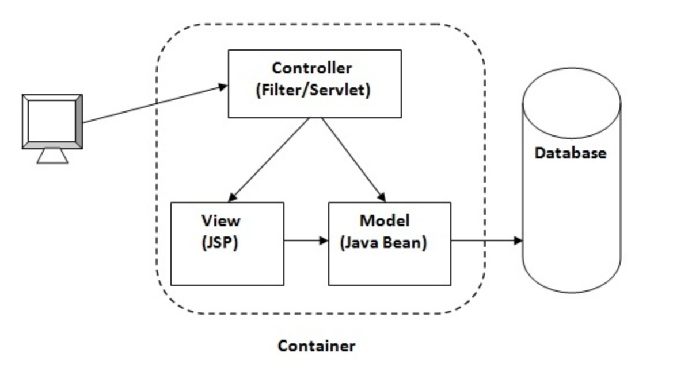
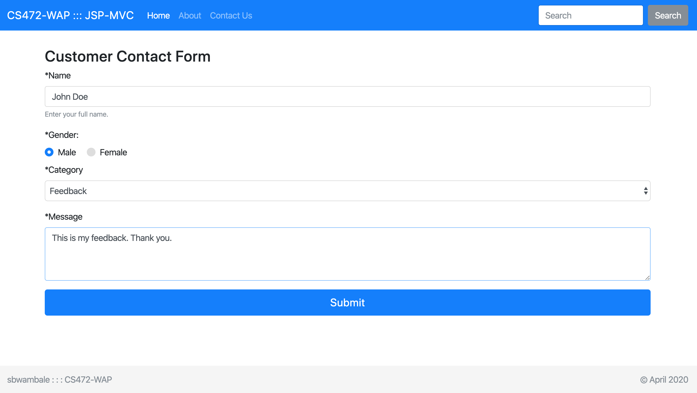
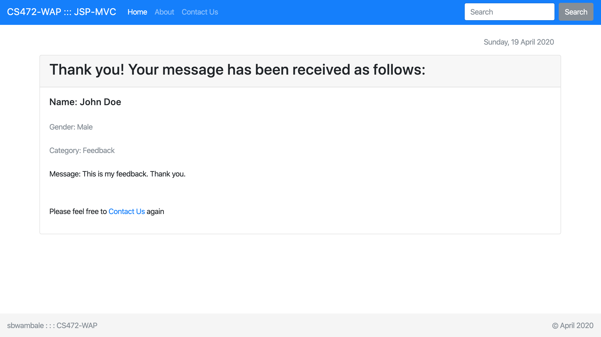

## Client Feedback MVC App with Servlets and JSPs

#### Description
This is an MVC app that enables a company keep contact with their clients/customers. The contact message may be an inquiry, to give feedback or log a complaint. It is implemented following the MVC 2 Architecture with WebSerlet `controllers`, a ContactMessage `model` and JSP `views`. 

#### Dependencies
- JDK 11

- Apache Tomcat 9.0.33

- Java Standard Tag Library 1.2

- Preferrably JetBrains IntelliJ IDE

#### To run the app
Clone the repo and run the Apache Tomcat server. Launch the browser with the the root URL. Click on the `Contact Us` nav menu and fill in the form. On submit, you should see the details that were filled in the form.

